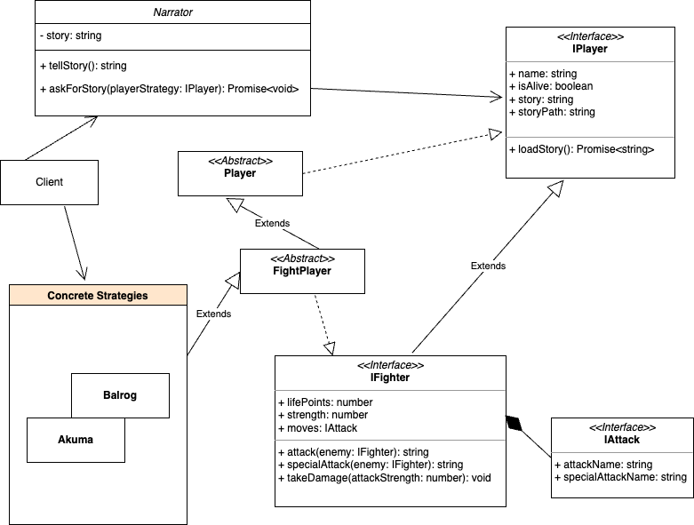

### Strategy Pattern
---

`"Strategy is a behavioral design pattern that lets you define a family of algorithms, put each of them into a separate class, and make their objects interchangeable."` [Design Patterns Guru](https://refactoring.guru/design-patterns/strategy)

[Design Patterns Guru](https://refactoring.guru/design-patterns/strategy)

---
##<a href="./01-example-street-fighter" style="color:white;">Street Fighter Example</a>

Saiba mais

Nesse exemplo, é possível observar o padrão _Strategy_ sendo utilizado em mais de um cenário.

O Padrão Strategy é utilizado para tornar intercambiável o uso das classes concretas `Akuma` e `Balrog` (nossos players) na chamada do método `askForStoryPlayer` da classe `Narrator`.

Cada classe que implementa `IPlayer` sabe como carregar e compartilhar sua própria história.

Em uma partida, havendo um `Narrator`, é possível solicitar que ele conte a história de um dos `FightPlayers` que estão no jogo.

Como cada `Player` tem sua própria história para contar e o `Narrator` não deve ser responsável por conhecer cada uma das histórias, apenas a que ele foi solicitado para contar, e nem carregá-las, utilizando o padrão _Strategy_ é possível que seja solicitado ao `Narrator` para contar a história de qualquer `Player`do jogo que respeite a interface `IPlayer`.

Mais detalhes no Diagrama a seguir:

Como os players sabem atacar e produzir dano nos oponentes uma ideia futura é construir um sistema de batalha.

Também há possibilidade de construir uma Web API para desenvolvimento de um Game integrado a uma aplicação front end.

Mais informações sobre o que cada _ator_ é capaz de fazer podem ser facilmente encontradas no descritivo de cada teste de unidade e integração.

#### Coverage

#### 100%

